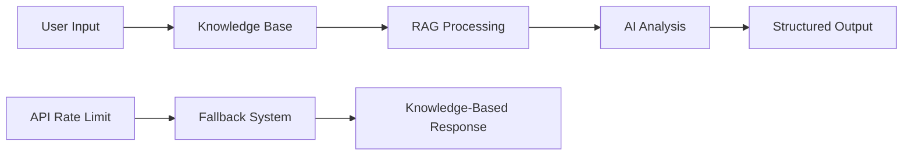

# 🤖 AI Features Documentation

## Overview
Trade-X implements advanced **RAG (Retrieval-Augmented Generation)** technology to provide intelligent portfolio management and trading insights.

## Features

### 1. RAG AI Analyzer
**Location**: Apps section → Advanced Portfolio Analyzer
**Purpose**: Comprehensive portfolio analysis using knowledge-enhanced AI

**Capabilities**:
- Sector diversification analysis
- Risk assessment with specific recommendations
- Strategic portfolio rebalancing suggestions
- Market context integration

**Technical Implementation**:
```javascript
// Knowledge base integration
const tradingKnowledgeBase = {
  sectors: { technology, finance, energy... },
  strategies: { diversification, risk_management... },
  riskManagement: { position_sizing, stop_loss... }
}

// RAG processing flow
userPortfolio + knowledgeBase + marketContext → AI Analysis → Structured Recommendations
```

### 2. Market Sentiment Analyzer
**Location**: Apps section → Real-time sentiment widget
**Purpose**: Track market mood and sentiment for your holdings

**Features**:
- Bullish/Bearish sentiment detection
- Confidence scoring (1-100%)
- Key market drivers identification
- Stock-specific sentiment analysis

### 3. Smart Trade Advisor
**Location**: Watchlist → Click on any stock symbol
**Purpose**: Individual stock analysis and trade recommendations

**Provides**:
- Entry/exit point suggestions
- Position sizing recommendations
- Risk analysis and stop-loss levels
- Technical and fundamental insights

## API Endpoints

```bash
# RAG-enhanced portfolio analysis
POST /ai/rag-recommendations
{
  "holdings": [...],
  "watchlist": [...],
  "query": "comprehensive"
}

# Market sentiment analysis
POST /ai/market-sentiment
{
  "stocks": ["RELIANCE", "TCS", "INFY"]
}

# Individual stock trade analysis
POST /ai/trade-analysis
{
  "stock": "RELIANCE",
  "tradeType": "BUY",
  "userPortfolio": [...]
}
```

## Fallback System

When API limits are reached, the system automatically switches to knowledge-base-driven recommendations:

```javascript
// Intelligent fallback
if (apiRateLimit) {
  return generateFallbackRecommendations(knowledgeBase, userPortfolio);
}
```

## Usage Guide

1. **Portfolio Analysis**: Go to Apps → Click "Analyze Portfolio"
2. **Market Sentiment**: Automatically loads in Apps section
3. **Stock Analysis**: Click any stock symbol in Watchlist
4. **Analysis Types**: Choose from comprehensive, risk-focused, sector, or growth analysis

## Architecture



---

*Built with Google Gemini API and custom RAG architecture*